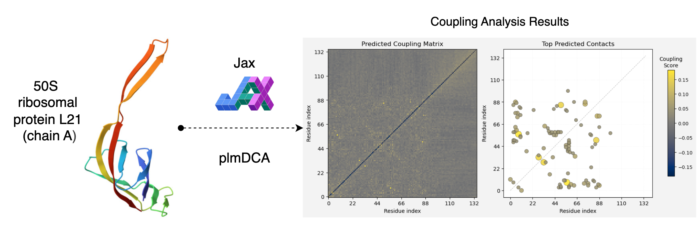

# evorca: fast and minimal plmDCA in JAX

Fast, minimal plmDCA in JAX. Turn MSAs into actionable contact maps and coupling matrices via a friendly CLI and a NumPy‑first Python API.




## Why evorca?

- Focused: Compact Potts‑model pipeline that’s easy to understand and extend.
- Productive: CLI for quick runs; Python API for downstream analysis.
- Performant: JAX + Optax for fast training on CPU/GPU; sparse I/O for large L.


## Table of Contents

- Installation
- Quickstart (CLI)
- Quickstart (Python API)
- Outputs
- Method Overview
- How to Cite
- References
- License

## Installation

```bash
pip install -e .
```

Optional: for GPU acceleration with CUDA, install a matching JAX build from the official instructions.


## Quickstart (CLI)

```bash
evorca help

# Fit from an A3M MSA
evorca fit path/to/alignment.a3m \
  --out output \
  --seq-type protein \
  --msa-subsample

# Visualize contact map
evorca viz --out output --topk 50 --seq-type protein
```


## Quickstart (Python API)
Returns NumPy arrays and optionally saves files.

```python
from pathlib import Path
import evorca as ev

# Fit and get arrays directly
res = ev.fit(
    Path("path/to/alignment.a3m"), Path("output"),
    seq_type="protein", epochs=10, batch=128,
    dtype="fp32", msa_subsample=True, apc=True
)
h = res["h"]         # (L, Q)
Jsym = res["Jsym"]   # (L, L, Q, Q)
score = res["score"] # (L, L)
meta = res["meta"]   # training metadata

# Visualize directly from arrays (no files needed)
ev.visualize_array(score, topk=50, seq_type="protein")

# If you prefer not to save files, pass out=None
res = ev.fit(Path("path/to/alignment.a3m"), out=None, seq_type="protein", epochs=1)
ev.visualize_array(res["score"])  # no files written

# Save a visualization PNG later
ev.visualize(Path("output"), topk=50, seq_type="protein")
```


## Outputs
- `h.npy`: single‑site fields.
- `sparse_J.npz`: pairwise couplings (upper‑triangular blocks).
- `Jsym.npy`: symmetrized, zero‑diagonal, zero‑sum‑gauge couplings.
- `score.npy`: Frobenius norm of couplings with optional APC.
- `contact_map.png`: visualization of the score matrix.


## Method Overview
evorca estimates pairwise statistical couplings from a multiple sequence alignment using a Potts model trained by pseudo‑likelihood. Given an A3M alignment, lowercase insertions are removed and sequences are encoded over a domain‑specific alphabet (proteins: 20 amino acids + gap; RNA: ACGU + gap, with T mapped to U). The alignment becomes a one‑hot tensor across sequences, positions, and alphabet states.

To reduce redundancy, sequence weights follow a Henikoff‑style scheme that ignores the gap channel. The model comprises single‑site fields and pairwise couplings; training minimizes the negative pseudo‑log‑likelihood (NPLL) of site‑conditionals with L2 regularization on both parameter sets. We optimize using AdamW in Optax with mini‑batches. Throughout training we enforce symmetry and remove self‑interactions; before scoring we apply a zero‑sum gauge to each pairwise block. Contacts are scored via the Frobenius norm of gap‑excluded coupling blocks and optionally refined with Average Product Correction (APC).


## Citation
If you use evorca in your research, please cite this software and the underlying methodology.

```bibtex
@misc{evorca2025,
  author       = {Shosuke Suzuki},
  title        = {evorca: Fast, minimal plmDCA in JAX},
  year         = {2025},
  howpublished = {\url{github.com/suzuki-2001/evorca}},
  note         = {Version 0.1.0}
}
```


## References
- Ekeberg, M., Lövkvist, C., Lan, Y., Weigt, M., & Aurell, E. (2013). Improved contact prediction in proteins: Using pseudolikelihoods to infer Potts models. Physical Review E, 87(1), 012707.
- Bradbury, J., Frostig, R., Hawkins, P., Johnson, M. J., Leary, C., Maclaurin, D., & Wanderman-Milne, S. (2018). JAX: composable transformations of Python+NumPy. https://github.com/google/jax
- Optax: https://github.com/google-deepmind/optax


## License
This project is distributed under the terms of the LICENSE file in this repository.
